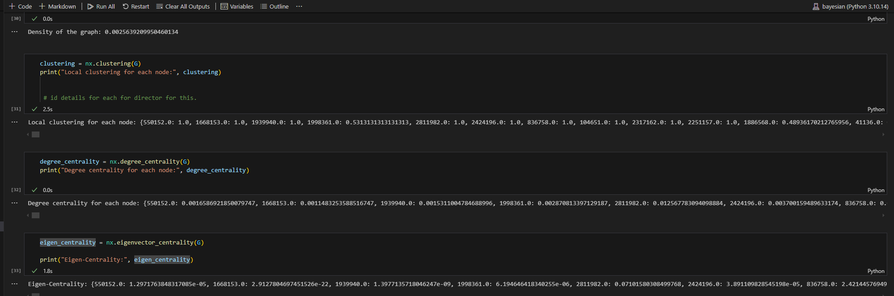

### Sunday

Finish the feature generation for everything, LDA - hold out set - what to do there? Just hold out and then run for everything as seen before, unsupervised approach and fully justified!!

Joining togeter, use the graphs created get the node id from everything in each year, and get everything needed

Get the graph for all years to get all nodes - or concatenate them together.

Director level details to merge in a bi-partite manner though (since now these are in edges), what should be done here? Use the melt approach as seen before!!

Here you can take the scores and features that's needed, from seeded LDA as seen before.

### Annual Gathering 

Save the results in batches in jsonl

Do text preprocessing in jsonl and parallelisation, read from a few lines in a file to the other (and could split the files as necessary)

Then with gensim combine everything together.

**Correction of report from before**

As seen from `4. Feature_Generation/5.RegressionAnalysis_data.ipynb` need to use `periodOfReport`  rather than `filedAt` from the previous annual report extraction, just change the query json string from before to check year from the documentation from before.

https://sec-api.io/docs/sec-filings-render-api/python-example

**Filtering : if you have more years, then filter by the appropriate years for meaningful analysis**

### Graph centrality

Use the eigen-centrality https://networkx.org/documentation/stable/reference/algorithms/generated/networkx.algorithms.centrality.eigenvector_centrality.html

Can use networkx to get the code for this!!

Can use the use the GPU code to get the centrality - to improve efficiency so try this up later!!

Eigencentrality runs fast - as seen with `3.UsefulAnalysesCode/explore_individual_network.ipynb` from a basic notebook for initial graph, if you do year by year, then you can do this efficiently!!

### Colab 

We can see that once google drive is mounted

We can easily save files to it so that it is useful

Try to add more 

### Overall plan

Got the Graph data, so next step is to get the LDA and sentiment section, and patent data that's it!!