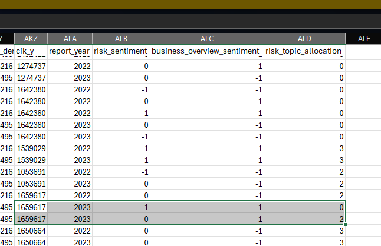

# Imperial_Dissertation_Research

### Implementation steps

First step

1. Added ssh keys to P1 machine, windows and WSL

1. Build initial graph structure  (bipartite and one mode dynamic - ask about structure of dynamic later.)
1. Try centality
1. Get API working for monthly payment of the annual report (get it ready to run it) (based on the sample data.)
1. Look at how to do SQL here!!

Second

1. Do further analysis of text analysis - topic modelling basic structure, LDA, sentiment analysis - and alternative structure from UDA course

Third

1. Try research ideas and look at how to tell a story
1. Create notebook template
1. 8 page limit. (Ask about the limit here.)

#### Problem

Computat tables missing - try to see how to fix this later!!

Otherwise do this manually.

#### dependent variable candidates

1. Research expense ratio (as a share of total value)
2. 

#### Event study

Take interesting events, and period dummy (events) e.g. Pandemic, financial crisis - contextual

- Need to take financial crisis before hand.
- Check hypothesis for these.

Look at some papers later - for which factors are meaningful.

##### Event study consideration for the future

1. need to consider lag
1. starting cannot be used as DV
1. usually the event in the middle is what's most important.
    - There is many endogeneity issues with panel data with instruments (check Bayesian approach)

### Fix later 

#### 1. Annual Report 

- look at at the period of report not filed at 
- make sure to change the query appropriately for this here!!

#### 2. Boardex

- Start with company to company relationships, and graphs for the workflow
- Link the right id (company or id) - made mistake there

#### 3. Compustat

- Look at the manual table details for getting the relevant data
- Take the GVKey from the other sources, and use that to get the information you need here.
- Lagged effect of putting the dependent variable, we need more years to study to do this!!
    - Make sure to do this for future analysis

#### 4. Merging mistake

Annual report has a merging mistake which needs to be fixed here also!!

There are duplicates merged with annual report and same company - maybe sub-sidiary reason check the id details for what's going on here!!

For example the following on annual reports

#### Weird behaviour

LDA multicore does not work properly

Try windows version and notebook later, for now just add it into notebook for the time being!!

Train model separately on collab and load the files - as seen here that's it!!